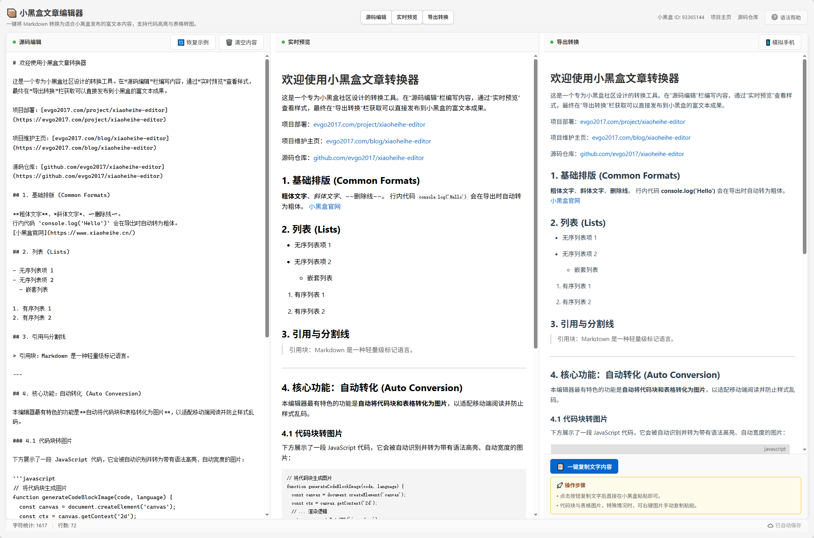

# 小黑盒文章编辑器 (HeyBox Article Editor)

# 

[中文] | [English](README.md)

## 🚀 简介

一款专为[小黑盒](https://xiaoheihe.cn/)社区设计的文章编辑器。它作为 Markdown 和小黑盒富文本发布时的桥梁，特别是针对代码块和表格这两大痛点。

**🌐 在线体验:** [evgo2017.com/project/xiaoheihe-editor](https://evgo2017.com/project/xiaoheihe-editor)

## 🚀 核心特性

- **Markdown 深度支持**：基于 ProseMirror 的成熟编辑体验。
- **实时同步预览**：源码、预览、导出三端同步，所见即所得。
- **自研代码转图**：针对小黑盒不支持代码块的限制，自动将代码片段渲染为带有语法高亮、适配移动端宽度的 Canvas 高清图片。
- **表格完美转图**：支持复杂表格渲染，自动处理单元格长文本换行，告别手机端乱码。
- **模拟手机视角**：一键切换 375px 窄屏模拟模式，预览文章在手机端的真实排版。
- **自动保存**：本地存储机制，防止因浏览器意外关闭导致内容丢失。
- **一键极简复制**：特制的复制逻辑，自动清理多余 HTML 标签及 alt 信息，确保护盒内粘贴效果完美。

## 📖 使用指南

1. 在**源码编辑**栏输入或粘贴您的 Markdown 文本。
2. 在**实时预览**栏查看基础样式。
3. 利用**模拟手机**功能微调移动端排版效果。
4. 点击**导出转换**下方的“一键复制文字内容”。
5. 直接粘贴到小黑盒发布页面即可。

---

### 👤 关于作者

- **GitHub:** [@evgo2017](https://github.com/evgo2017)
- **小黑盒 ID:** 93365144 📦

## 📄 许可证

本项目采用 **GNU General Public License v3.0**。详情请参阅 [LICENSE](LICENSE) 文件。
